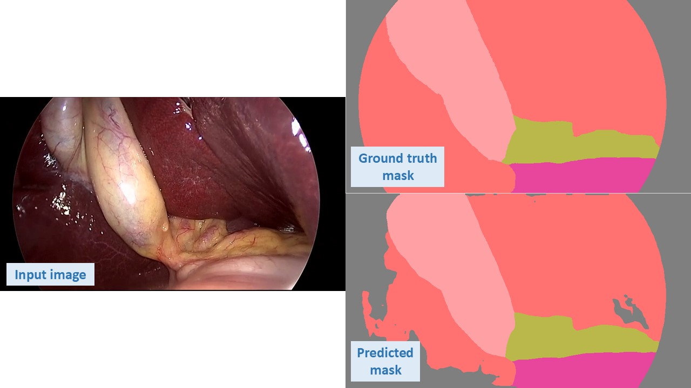

# Train_CholecSeg8k_with_DeeplabV3Res101_pytorch
## 🚀 Update
02/07: Upload the pre-trained model ```epoch_39_loss_0.0630.pth``` with average IOU score = 0.9289
## Auto-segmentation in laparoscopic cholecystectomy images
This project utilizes the DeepLabV3_Res101 model, provided by the official PyTorch library, to train on the CholecSeg8k dataset, which consists of 8,080 image-mask pairs.

